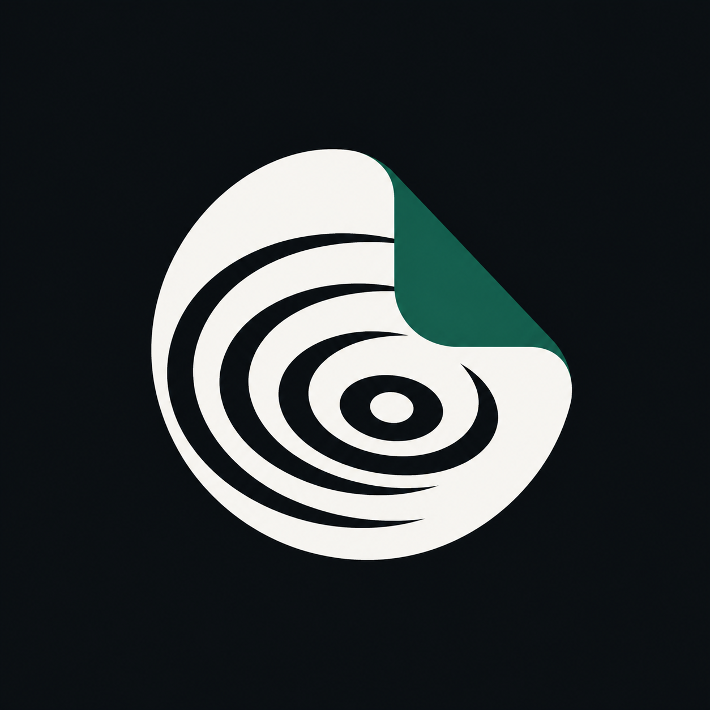

<p align="center">
  
</p>

<h1 align="center">Remember</h1>

<p align="center"><strong>Your private Personal Life OS: remember, decide, act, and reset.</strong></p>

<p align="center">
  <a href="https://github.com/vulnix0x4/remember/actions/workflows/ci.yml"></a>
  <a href="LICENSE"></a>
  
  
</p>

Remember is a private, self-hostable Personal Life OS. It combines the knowledge that shapes you with goals, an adaptive task engine, calendar, files, health, and money in one calm command center. Save a source, choose a direction, do one concrete move, and keep the rest of life visible without handing it to an advertising platform.

The product is dark-first, responsive, accessible, and available as a web app/PWA, Chromium extension, and native SwiftUI iPhone app with a Share Extension.

> There is no public hosted demo. Clone this repository to run your own archive.

## Seven apps, one private system

- **Today** is the command center: one active move, today’s commitments, goal direction, health, net worth, and private files.
- **Remember** captures YouTube, TikTok, X, and web sources, produces validated analysis, answers with citations, and resurfaces patterns over time.
- **Goals** turn observable outcomes into concrete next moves instead of disconnected wish lists.
- **Tasks** use the RESET execution model: exactly one active move, a focus timer, automatic next-action selection, blocker-aware shrinking, and a daily Life Floor.
- **Calendar** combines synced Apple events, manual events, and scheduled moves without turning every task into calendar clutter.
- **Health** imports user-approved Apple Health measurements and also supports private manual logging.
- **Money** keeps balances and transactions in a calm ledger ready for manual, CSV, or provider-backed sync.
- **Files** stores private documents in R2 with user-owned metadata, search, download, and account-deletion cleanup.

All modules share one authenticated, ownership-scoped data model, with a resilient device cache and an honest local-only fallback when no API is configured. Portable JSON and Markdown exports include both saved knowledge and Life OS data.

## Repository

```text
apps/web              React + Vite web app and installable PWA
apps/api              Hono API on Cloudflare Workers
packages/domain       Shared Zod schemas and domain contracts
extensions/browser    Manifest V3 Chromium capture extension
ios                    SwiftUI app and App Group Share Extension
docs                   Architecture, design, and quality evidence
```

The backend uses Cloudflare D1, R2, Vectorize, Workers AI, Workflows, and Cron Triggers. D1 is the private relational source of truth, R2 stores vault files and exports, and AI analysis stays behind a provider-neutral boundary. Local development uses deterministic fixtures; a self-hosted production deployment can use OpenRouter or another compatible provider.

## Quick start

Requirements: Node.js 22+, pnpm 11+, and a current Chromium browser.

```sh
corepack enable
pnpm install --frozen-lockfile
pnpm check
```

Start the local Worker:

```sh
cp apps/api/.dev.vars.example apps/api/.dev.vars
pnpm --filter @remember/api db:migrate
pnpm --filter @remember/api dev
```

In a second terminal, start the web app:

```sh
pnpm --filter @remember/web dev
```

Open the printed local URL. Localhost uses an isolated development identity and deterministic analysis, so no production credentials are required.

## iPhone app

Requirements: Xcode 26+, an iOS 26 simulator, and [XcodeGen](https://github.com/yonaskolb/XcodeGen).

```sh
cd ios
xcodegen generate
xcodebuild -project Remember.xcodeproj -scheme Remember \
  -destination 'platform=iOS Simulator,name=iPhone 17 Pro,OS=latest' test
```

For a signed device build, copy `ios/Local.xcconfig.example` to `ios/Local.xcconfig`, fill in your bundle ID, App Group, and Apple team, then pass it to `xcodebuild` with `-xcconfig ios/Local.xcconfig`. Enable HealthKit for the app identifier. Apple Health and Calendar permission prompts appear only after the user explicitly taps Sync; the local file is ignored by Git.

## Browser extension

1. Open `chrome://extensions`.
2. Enable **Developer mode** and choose **Load unpacked**.
3. Select `extensions/browser`.
4. Use the popup, context menu, or `Command+Shift+S` to save a page.

The extension requests access only to the configured API origin. Private access tokens stay in local extension storage and are never bundled in this repository.

## Self-hosting on Cloudflare

1. Copy `apps/web/.env.production.example` to `apps/web/.env.production` and set your Worker origin.
2. Replace the example domain and resource IDs in `apps/api/wrangler.jsonc`.
3. Provision D1, R2, Vectorize, and the Workflow resources declared by the config.
4. Set `LOGIN_EMAIL`, `LOGIN_PASSWORD_HASH`, `SESSION_SECRET`, and `OPENROUTER_API_KEY` with `wrangler secret put`.
5. Apply migrations, run the production dry-run, and deploy intentionally.

```sh
pnpm --filter @remember/api exec wrangler d1 migrations apply remember-db-production --remote --env production
pnpm --filter @remember/api exec wrangler deploy --dry-run --env production
pnpm --filter @remember/api exec wrangler deploy --env production
```

Production login uses a signed seven-day `HttpOnly`, `Secure`, `SameSite=Strict` session cookie. Every repository query enforces ownership, authenticated API responses are `private, no-store`, and the PWA never caches private API data.

## Quality

Run the complete JavaScript/TypeScript release gate with:

```sh
pnpm check
```

Run the native gate with:

```sh
./scripts/ci-ios.sh
```

Coverage includes URL safety, authentication and ownership, capture/deduplication, retry and partial failures, provider schema validation, grounded citations, exports, responsive UI flows, accessibility, API mapping, Share Extension handoff, Dynamic Type, and native navigation. See [docs/QUALITY.md](docs/QUALITY.md) for the detailed release evidence.

## Privacy boundaries

- The model receives only the source material needed for the requested analysis.
- Model output is validated before persistence and records provenance.
- Interpretations about the user are labeled as hypotheses, never facts.
- Ask does not use the open web; it cites only user-owned saved material.
- HealthKit and EventKit permissions are requested only from an explicit sync action; Remember reads only approved categories.
- Financial sync endpoints accept normalized provider data, but no bank credential is stored by the checked-in app.
- Vault objects are namespaced by user and removed with account deletion.
- Generic links are saved as bookmarks unless a trustworthy source adapter can extract usable text.
- Secrets belong in Worker secret storage, Keychain, or ignored local files, never source control.

## Contributing

Issues and pull requests are welcome. Read [CONTRIBUTING.md](CONTRIBUTING.md), follow the [Code of Conduct](CODE_OF_CONDUCT.md), and report vulnerabilities through [SECURITY.md](SECURITY.md).

## License

Remember is released under the [MIT License](LICENSE).
